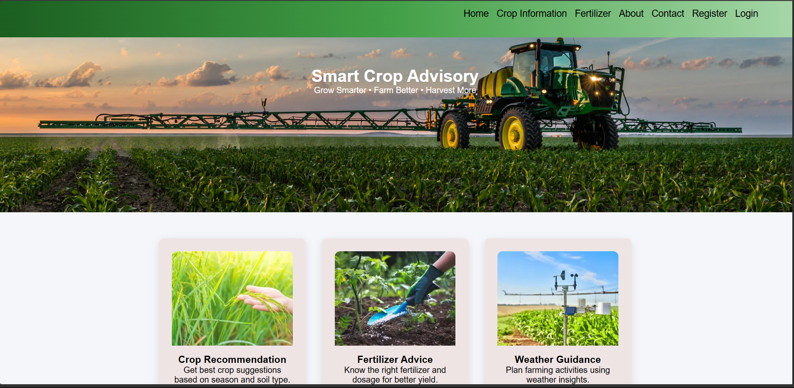
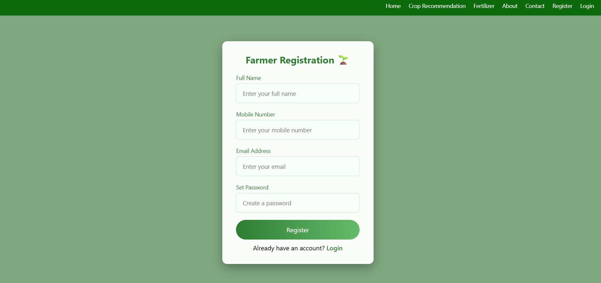
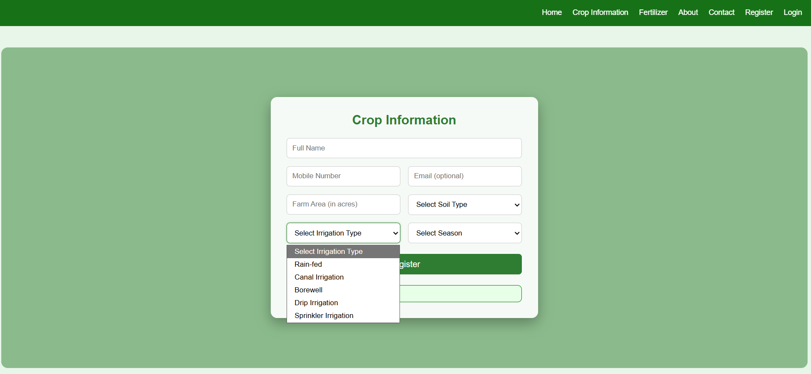
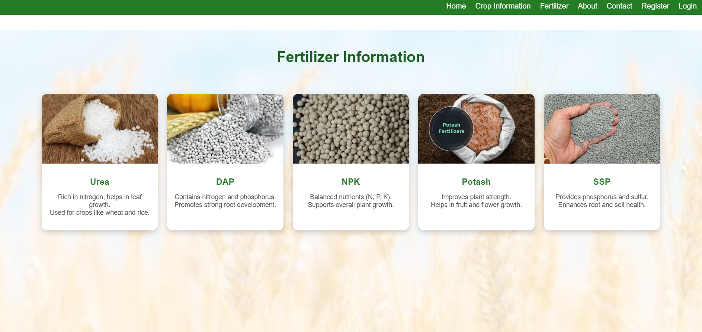
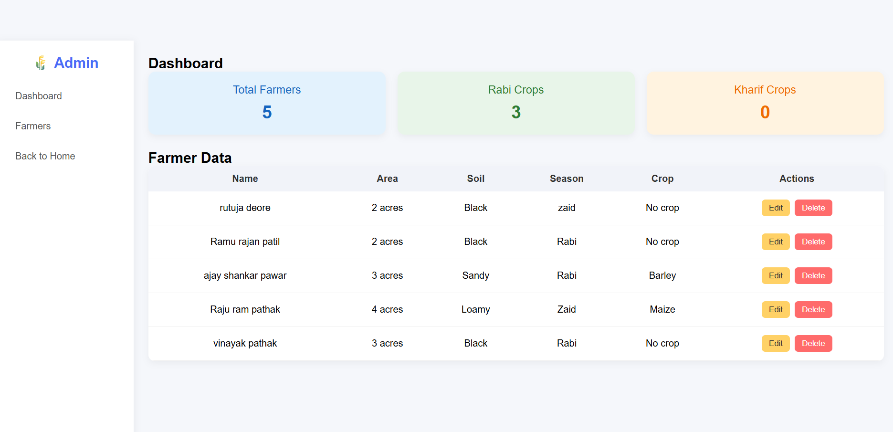

# 🌾 Crop Management System

A web-based **Crop Management System** developed using **HTML, CSS, JavaScript, Node.js, Express.js, and MySQL**. The application helps farmers register their details, receive crop recommendations based on farming conditions, and access fertilizer information. It also provides an admin interface to manage farmer records.

---

## Project Overview

The Crop Management System is designed to assist farmers in selecting suitable crops based on agricultural parameters such as **soil type**, **season**, **irrigation type**, and **land area**.

The system stores farmer information in a MySQL database and retrieves the most suitable crop by matching the farmer's input with crop data stored in the database. It also provides fertilizer information through an easy-to-use card-based interface.

---

## ✨ Features

### 👨‍🌾 Farmer Registration
- Register using:
  - Full Name
  - Mobile Number
  - Email Address
  - Password

### 🌱 Crop Recommendation
- Farmer enters:
  - Soil Type
  - Season
  - Irrigation Type
  - Land Area
- The application searches the MySQL database and recommends the most suitable crop.

### 💾 Database Integration
- Stores farmer information in MySQL.
- Updates the farmer's record with the recommended crop.

### 🌿 Fertilizer Information
- Displays different fertilizers using informative cards.
- Helps farmers understand commonly used fertilizers.

###  Admin Panel
- View all farmer records.
- Update farmer details.
- Delete farmer records.

---

##  Technologies Used

### Frontend
- HTML5
- CSS3
- JavaScript

### Backend
- Node.js
- Express.js

### Database
- MySQL

### Node Packages
- Express
- MySQL2
- Body-parser
- CORS

---

## 📂 Project Structure

```
Crop_Management/
│
├── node_modules/
├── public/
│   ├── admin.html
│   ├── admin.js
│   ├── fertilizer.html
│   ├── fertilizer.css
│   ├── hom.html
│   ├── hom.css
│   ├── login.html
│   ├── login.css
│   ├── reg.html
│   ├── reg.css
│   ├── reg.js
│   ├── Register_farm.html
│   ├── Register_farm.css
│   ├── index.js
│   └── images/
│
├── index.js
├── package.json
├── package-lock.json
├── .gitignore
└── README.md
```

---

## ⚙️ Installation

### 1. Clone the Repository

```bash
git clone https://github.com/kaveri-dhikale/Crop-Management-System.git
```

### 2. Open the Project

```bash
cd Crop-Management-System
```

### 3. Install Dependencies

```bash
npm install
```

### 4. Configure MySQL

Create a MySQL database named:

```
crop_management
```

Import the SQL file into MySQL.

### 5. Start the Server

```bash
npm start
```

The server will start on:

```
http://localhost:3000
```

---

## 🗄️ Database Tables

The project uses the following database tables:

- users
- farmer_data
- crops

---

## 📸 Screenshots

Add screenshots of your application here after uploading the project.


<!-- ```
screenshots/
│
├── home.png
├── registration.png
├── crop-recommendation.png
├── fertilizer.png
└── admin-panel.png
``` -->

## 📸 Screenshots

###  Home Page



---

### Farmer Registration 


---

### 🌱 Crop Recommendation



---

### 🌿 Fertilizer Page



---

### 👨‍💼 Admin Dashboard




##  Future Improvements

- User Authentication
- Password Encryption
- Search & Filter Functionality
- Weather API Integration
- Machine Learning-based Crop Recommendation
- Fertilizer Recommendation based on Crop
- Responsive Mobile Design
- Farmer Dashboard
- Report Generation

---

##  Learning Outcomes

Through this project, I gained practical experience in:

- Building full-stack web applications
- Node.js and Express.js development
- CRUD operations
- REST API development
- MySQL database integration
- Frontend and backend communication
- Form handling and validation

---

## 👨‍💻 Author

**Kaveri Dhikale**

Bachelor of Engineering (Computer Engineering)

